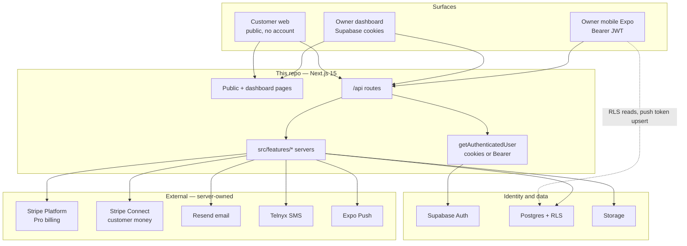

# ServiceLink architecture

How the product is wired: three client surfaces, one Next.js hub, server-owned side effects.

This is the durable map for a growing codebase. Feature-level flows live next to the feature (`src/features/*/docs`). Mobile API contracts live in [`docs/contracts/`](./contracts/).

---

## The picture



**This repo is the hub.** The Expo app is a separate client. It does not hold Stripe, Telnyx, Resend, or Expo Push secrets. It calls this API.

---

## Three surfaces

| Surface                 | Who                        | Auth                                   | Role                                                          |
| ----------------------- | -------------------------- | -------------------------------------- | ------------------------------------------------------------- |
| **Customer web**        | End customers              | None, or a token in the URL            | Public profile, book, subscribe, quote, review, marketplace   |
| **Owner dashboard**     | Business owners at a desk  | Supabase **cookies**                   | Plan work, quotes, payments, memberships, marketing, settings |
| **Owner mobile (Expo)** | Business owners on the job | `Authorization: Bearer <access_token>` | Field ops, job SMS actions, Tap to Pay, push                  |

Auth for owner APIs is one function: [`src/libs/api/getAuthenticatedUser.ts`](../src/libs/api/getAuthenticatedUser.ts). Web and mobile share the same feature servers under `src/features/`.

Routes live in [`src/constants/routes.ts`](../src/constants/routes.ts) — do not hardcode paths in components.

---

## Mobile’s role

The dashboard is the office. Mobile is the driveway.

**Golden rule:** the app **triggers actions and reads state**. The server owns provider keys, message templates, rate limits, ownership checks, and the `bookings.job_status` state machine.

| Mobile owns                               | Server owns                              |
| ----------------------------------------- | ---------------------------------------- |
| Supabase session + Bearer token           | Stripe Checkout, PaymentIntents, Connect |
| Expo push token → `user_push_tokens`      | Telnyx send + `sms_messages` writes      |
| Deep links `servicelinkmobile://`         | Resend templates                         |
| Stripe Terminal / Tap to Pay SDK (iPhone) | Expo Push API delivery                   |
| Field UI (job actions, complete sheet)    | Job status transitions                   |
| Same `isProAccess` rules as web           | Idempotency and rate limits              |

Mobile **may** `SELECT` some tables via RLS (for example SMS history). It **must not** insert SMS rows or mutate `job_status` locally.

App Store: mobile does **not** sell Pro. Plan changes stay on web. Mobile still reads the same `profiles` entitlement fields — see [`docs/contracts/mobile-entitlement-paywall.md`](./contracts/mobile-entitlement-paywall.md).

Contracts (the Expo app is not in this workspace):

- [`mobile-booking-actions.md`](./contracts/mobile-booking-actions.md) — job lifecycle + SMS
- [`mobile-booking-tap-to-pay.md`](./contracts/mobile-booking-tap-to-pay.md)
- [`mobile-push-notifications.md`](./contracts/mobile-push-notifications.md)
- [`mobile-onboarding-complete.md`](./contracts/mobile-onboarding-complete.md)
- Full list: `docs/contracts/mobile-*.md`

---

## Customer journeys (no login)

| Journey    | Entry                             | Then                                                                                 |
| ---------- | --------------------------------- | ------------------------------------------------------------------------------------ |
| Book       | `/{slug}` or `/find-detailers`    | Book flow → Stripe Checkout (Connect) → webhook creates booking → email + owner push |
| Membership | `/{slug}/subscribe`               | Stripe subscription → later `/{slug}/membership/visit`                               |
| Quote      | `/{slug}/quote`                   | Owner inbox (web or mobile) → send → `/q/{token}` → book                             |
| Review     | `/review/{token}`                 | Public reviews on the profile                                                        |
| Receipt    | `/r/{code}` or `/i/{publicToken}` | After job completed                                                                  |

Marketplace listings are **derived** (Pro + live profile + services + location). Owners do not opt in to a separate marketplace UI.

---

## Owner operations

```text
confirmed → on_the_way → job_started → work_finished → job_completed
                SMS           SMS         Done/Skip      receipt + review invite
                                                          Tap to Pay / cash / app
```

Web and mobile both call `POST /api/availability/bookings/{id}/actions`. Money:

| Path               | Where                    | Stripe                               |
| ------------------ | ------------------------ | ------------------------------------ |
| Pro SaaS           | Web `/dashboard/upgrade` | Platform Checkout                    |
| Online booking pay | Customer book link       | Connect Checkout                     |
| Membership         | Customer subscribe       | Connect subscription                 |
| Remainder on site  | Owner iPhone             | Connect PaymentIntent + Terminal SDK |
| Cash / app / other | Complete sheet           | None                                 |

---

## Feature domains

Code is grouped by **feature** under `src/features/`, not by file type. Pages and `/api` routes stay thin.

| Domain                  | Docs                                                                                                            |
| ----------------------- | --------------------------------------------------------------------------------------------------------------- |
| Availability / bookings | [`src/features/availability/docs/FLOWS.md`](../src/features/availability/docs/FLOWS.md)                         |
| Payments                | [`src/features/payments/docs/BOOKING_CHECKOUT_FLOW.md`](../src/features/payments/docs/BOOKING_CHECKOUT_FLOW.md) |
| Memberships             | [`src/features/subscriptions/docs/FLOWS.md`](../src/features/subscriptions/docs/FLOWS.md)                       |
| Quotes                  | [`src/features/quotes/docs/README.md`](../src/features/quotes/docs/README.md)                                   |
| Reviews                 | [`src/features/reviews/docs/FLOWS.md`](../src/features/reviews/docs/FLOWS.md)                                   |
| Marketplace             | [`src/features/marketplace/docs/FLOWS.md`](../src/features/marketplace/docs/FLOWS.md)                           |
| Pro vs Free             | [`docs/subscription-and-pro-features.md`](./subscription-and-pro-features.md)                                   |

When you add a surface, a vendor, or a mobile-only behavior: update this file and the matching `docs/contracts/mobile-*.md` in the same change.
