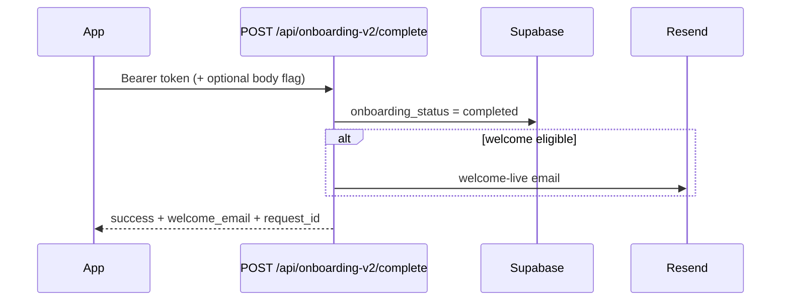

# Contract: Mobile onboarding — complete + welcome-live email

When the user finishes onboarding step 5 (“Activate my link”), call this API so the **server** marks onboarding complete and sends **“Your business is officially LIVE!”** (Resend).

**Do not** send this email from the mobile app. **Do not** rely only on a local Supabase update unless you also call this endpoint (with the flag below).

Related: Pro trial onboarding uses `POST /api/stripe/start-onboarding-trial` or Checkout + confirm — those paths send the same email via `runOnboardingTrialBridgeAfterSubscribe` and **do not** require this call.

---

## Endpoint

| | |
|---|---|
| **Method** | `POST` |
| **Path** | `/api/onboarding-v2/complete` |
| **Production** | `https://myservicelink.app/api/onboarding-v2/complete` (or your deployed `NEXT_PUBLIC_SITE_URL` + path) |
| **Local** | `http://localhost:3000/api/onboarding-v2/complete` |

---

## Authentication

| Header | Value | Required |
|--------|-------|----------|
| `Authorization` | `Bearer <Supabase access_token>` | **Yes** (mobile) |
| `Content-Type` | `application/json` | Optional (omit if no body) |

Web uses Supabase session cookies instead of Bearer; mobile **must** send Bearer (same as `POST /api/stripe/create-checkout-session`).

Use a **fresh** access token from `supabase.auth.getSession()` (refresh if expired).

---

## Optional tracing header (recommended)

| Header | Value |
|--------|-------|
| `X-Request-ID` or `X-Correlation-ID` | UUID from the app (e.g. `UUID().uuidString`) |

If set, the same id is echoed in the JSON response as `request_id` and appears in server logs — use it when contacting support.

---

## Request body (JSON, optional)

### A) Recommended — server owns completion (Free tier step 5)

```http
POST /api/onboarding-v2/complete
Authorization: Bearer eyJhbG...
```

No body, or:

```json
{}
```

### B) App already set `onboarding_status = completed` in Supabase

Call **once** with:

```json
{
  "sendWelcomeEvenIfAlreadyCompleted": true
}
```

| Field | Type | Default | Notes |
|-------|------|---------|-------|
| `sendWelcomeEvenIfAlreadyCompleted` | `boolean` | `false` | When `true`, welcome email is still attempted if status was already `completed`. **Do not** call repeatedly — risk of duplicate emails. |

---

## Success response (HTTP `200`)

```json
{
  "success": true,
  "request_id": "550e8400-e29b-41d4-a716-446655440000",
  "welcome_email": {
    "attempted": true,
    "sent": true
  }
}
```

### `welcome_email` shapes

**Sent:**

```json
{ "attempted": true, "sent": true }
```

**Resend failed** (onboarding still completed; check server logs + `RESEND_API_KEY`):

```json
{
  "attempted": true,
  "sent": false,
  "error": "RESEND_API_KEY is not set"
}
```

**Skipped — not an error for onboarding:**

| `welcome_email` | Meaning | Mobile action |
|-----------------|---------|----------------|
| `{ "attempted": false, "reason": "already_completed_no_flag" }` | Profile was already `completed` and flag was not `true`. | Retry once with `sendWelcomeEvenIfAlreadyCompleted: true`, or fix flow to call API before local complete. |
| `{ "attempted": false, "reason": "no_owner_email" }` | Auth user has no email. | Rare; user must have email at sign-up. |
| `{ "attempted": false, "reason": "no_business_profile" }` | No `business_profiles` row for this user. | Finish steps 1–4 (business + slug) first. |
| `{ "attempted": false, "reason": "no_business_slug" }` | Business exists but `business_slug` empty. | Complete step 4 (claim link) before step 5. |

**Treat `success: true` as “onboarding complete on server.”** Email is best-effort; log `welcome_email` in non-prod or support builds.

---

## Error responses

| HTTP | `success` | Typical `error` | Mobile action |
|------|-----------|-----------------|---------------|
| `401` | `false` | `Authentication required` / `Invalid or expired session` | Refresh session; re-login |
| `400` | `false` | Supabase update message | Show error; do not advance UI |
| `500` | `false` | `Something went wrong` | Retry with backoff; include `request_id` in support |

All error bodies include `request_id` when the handler assigned one:

```json
{
  "success": false,
  "error": "Invalid or expired session",
  "request_id": "550e8400-e29b-41d4-a716-446655440000"
}
```

---

## Mobile integration flow



1. User finishes step 5 (slug, availability, etc.).
2. Obtain `access_token` from Supabase session.
3. `POST /api/onboarding-v2/complete` with `Authorization: Bearer …`.
4. If `success` → navigate to dashboard / live profile.
5. In debug builds, log `request_id` and `welcome_email` to the console.

### Example (fetch)

```ts
const session = (await supabase.auth.getSession()).data.session;
if (!session?.access_token) throw new Error('Not signed in');

const requestId = crypto.randomUUID();

const res = await fetch(`${API_BASE}/api/onboarding-v2/complete`, {
  method: 'POST',
  headers: {
    Authorization: `Bearer ${session.access_token}`,
    'Content-Type': 'application/json',
    'X-Request-ID': requestId,
  },
  body: JSON.stringify({
    // Only if you already wrote onboarding_status = completed in Supabase:
    // sendWelcomeEvenIfAlreadyCompleted: true,
  }),
});

const data = await res.json();
// data.request_id, data.welcome_email
if (!res.ok || !data.success) {
  throw new Error(data.error ?? `HTTP ${res.status}`);
}
```

### Example (curl, staging)

```bash
curl -sS -X POST 'https://myservicelink.app/api/onboarding-v2/complete' \
  -H "Authorization: Bearer YOUR_ACCESS_TOKEN" \
  -H "Content-Type: application/json" \
  -H "X-Request-ID: test-$(date +%s)" \
  -d '{}'
```

---

## Production debugging (server logs)

Search for **`[onboarding:activate]`**. Simple transactional lines only (no user ids or emails).

| Line | When |
|------|------|
| `complete request started` | Request accepted |
| `welcome email sent` | Resend accepted the welcome-live send |
| `welcome email skipped (<reason>)` | No send — see reason code in parentheses |
| `complete succeeded` | Onboarding marked complete |
| `auth failed` | 401 |
| `complete failed` | Could not update profile |
| `welcome email failed` | Resend error — see `welcome_email` in API response |
| `unexpected error` | 500 |

Use `request_id` from the JSON response (or `X-Request-ID`) to match a single activation in your log host’s request grouping, if available.

---

## Troubleshooting

| Symptom | Likely cause | Fix |
|---------|--------------|-----|
| `401` | Expired token or wrong project URL/anon key | Refresh session; verify Supabase env matches API host |
| `welcome_email.reason = already_completed_no_flag` | App set `completed` in Supabase before API without flag | Call API with `sendWelcomeEvenIfAlreadyCompleted: true` once, or stop pre-writing status |
| `welcome_email.reason = no_business_slug` | Step 4 slug not saved | Persist slug via step 4 API before step 5 |
| `welcome_email.sent = false`, `error` mentions Resend | `RESEND_API_KEY` / domain | Fix server env (ops); onboarding still complete |
| No email, `welcome_email.sent = true` in response | Deliverability / spam | Check inbox + spam; verify Resend dashboard |
| Duplicate emails | Multiple calls with `sendWelcomeEvenIfAlreadyCompleted: true` | Call once on step 5 |

---

## Preconditions checklist

Before calling this endpoint:

- [ ] User signed in (valid Bearer token)
- [ ] `business_profiles` row exists for `profile_id = user.id`
- [ ] `business_profiles.business_slug` is non-empty (step 4)
- [ ] User has an email on the auth account
- [ ] Step 5 UI calls this API **once** per activation

---

## Changelog

| Date | Note |
|------|------|
| 2026-05 | Bearer auth, `sendWelcomeEvenIfAlreadyCompleted`, `welcome_email` + `request_id` in response, `[onboarding:activate]` transactional logs |
