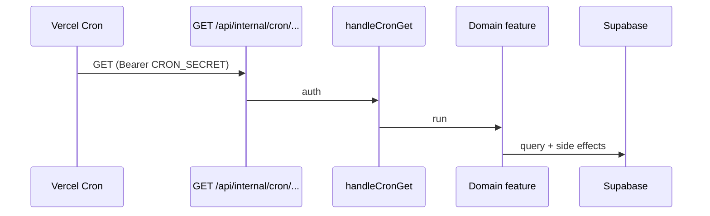

# Cron feature

A **cron job** is a task the server runs on a clock — not because a user tapped something. You pick a schedule (“every day at 2pm UTC”), and the host calls a URL at that time.

This feature owns the **shared plumbing**. Each job’s work stays in the domain feature that owns the data (availability, SMS, etc.).

| Piece | Path |
| ----- | ---- |
| Job catalog | `src/features/cron/jobs.ts` |
| Auth | `src/features/cron/server/verifyInternalCronAuth.ts` |
| GET helper | `src/features/cron/server/handleCronGet.ts` |
| Vercel schedule | [`vercel.json`](../../../../vercel.json) (`crons`) |
| Routes | `API_ROUTES.INTERNAL_CRON_*` in `src/constants/routes.ts` |

---

## How it works here

We use **Vercel Cron**. On each fire, Vercel:

1. GETs the path listed in `vercel.json`
2. Adds `Authorization: Bearer $CRON_SECRET` (only if that env var is set on the Vercel project)
3. Our route checks the secret via `handleCronGet`, then runs the job

Nothing in the database wakes itself up. The clock is Vercel; the work is our route.

`CRON_SECRET` belongs on **Vercel only**. You do not need it in `.env.local` unless you want to hit the cron URL on localhost.



---

## Jobs

Keep this table, `CRON_JOBS` in `jobs.ts`, and `vercel.json` in sync. A unit test fails if the catalog and `vercel.json` drift.

| id | Schedule | What it does |
| -- | -------- | ------------ |
| `booking-reminders` | `0 14 * * *` (14:00 UTC daily) | Confirmed bookings **tomorrow** (`America/Chicago`): one owner push (“You have an appointment coming up.”) plus customer email and/or SMS when we have that contact. |

### booking-reminders

- **Route:** `GET /api/internal/cron/booking-reminders`
- **Work:** `src/features/availability/booking/server/reminders/`
  - Owner: `runOwnerBookingReminders` — Expo push + in-app bell
  - Customer: `runCustomerBookingReminders` — email via Resend, SMS via `sendAndRecordSms` (shows in the owner message inbox)
- **Owner idempotency:** `notifications.dedupe_key` = `booking_reminder:{ownerProfileId}:{targetDate}`
- **Customer SMS idempotency:** `sms_messages.dedupe_key` = `{bookingId}:booking_reminder:{scheduledDate}`
- **SMS type:** `booking_reminder` (same table as confirmation / on-the-way)
- **SMS gates:** same as other customer texts (opt-in, Telnyx, business eligible)
- **Mobile tap (owner):** [`docs/contracts/mobile-push-notifications.md`](../../../../docs/contracts/mobile-push-notifications.md) — `screen` → `bookings`

---

## Auth

The routes are on the public internet, so they fail closed:

| Header | When |
| ------ | ---- |
| `Authorization: Bearer $CRON_SECRET` | Vercel’s automatic cron call |
| `x-internal-push-secret: $INTERNAL_PUSH_API_SECRET` | Manual test |

If **neither** secret is set → `503`. Wrong secret → `401`.

**Manual test (after deploy):**

```bash
curl -i https://<your-domain>/api/internal/cron/booking-reminders \
  -H "x-internal-push-secret: $INTERNAL_PUSH_API_SECRET"
```

---

## Adding another job

1. Write an idempotent function in the **owning feature** (query + side effects).
2. Add the path to `API_ROUTES` in `src/constants/routes.ts`.
3. Append a row to `CRON_JOBS` in `jobs.ts`.
4. Append the same `path` + `schedule` under `crons` in `vercel.json`.
5. Add `src/app/api/internal/cron/<name>/route.ts`:

```ts
import { handleCronGet } from '@/features/cron';

export const runtime = 'nodejs';
export const maxDuration = 60;

export const GET = handleCronGet(async ({ request }) => {
  return yourJob({ correlationId: request.headers.get('x-vercel-id') });
});
```

6. Document the job in the table above.

Hobby Vercel plans only allow **daily** schedules. Hourly needs Pro or another scheduler.
