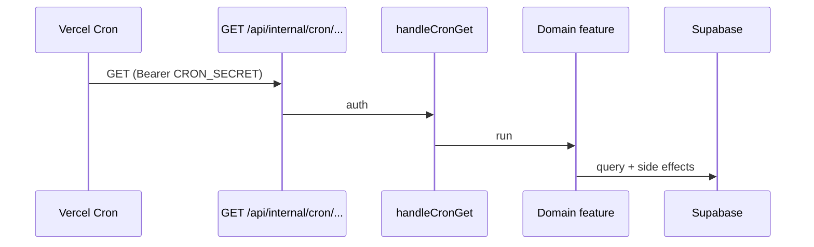

# Cron feature

A **cron job** is a task the server runs on a clock — not because a user tapped something.

This feature owns the **shared plumbing**. Each job’s work stays in the domain feature that owns the data.

| Piece           | Path                                                      |
| --------------- | --------------------------------------------------------- |
| Job catalog     | `src/features/cron/jobs.ts`                               |
| Auth            | `src/features/cron/server/verifyInternalCronAuth.ts`      |
| GET helper      | `src/features/cron/server/handleCronGet.ts`               |
| Vercel schedule | [`vercel.json`](../../../../vercel.json) (`crons`)        |
| Routes          | `API_ROUTES.INTERNAL_CRON_*` in `src/constants/routes.ts` |

---

## How it works here

We use **Vercel Cron**. On each fire, Vercel:

1. GETs the path listed in `vercel.json`
2. Adds `Authorization: Bearer $CRON_SECRET` (only if that env var is set on the Vercel project)
3. Our route checks the secret via `handleCronGet`, then runs the job

Nothing in the database wakes itself up. The clock is Vercel; the work is our route.

`CRON_SECRET` belongs on **Vercel only**. You do not need it in `.env.local` unless you want to hit the cron URL on localhost.



---

## Jobs

Keep this table, `CRON_JOBS` in `jobs.ts`, and `vercel.json` in sync. A unit test fails if the catalog and `vercel.json` drift. Both jobs share `0 14 * * *` (14:00 UTC daily).

| id                         | Work                                                            | Docs                                                                                  |
| -------------------------- | --------------------------------------------------------------- | ------------------------------------------------------------------------------------- |
| `booking-reminders`        | Tomorrow’s confirmed bookings: owner push + customer email/SMS  | [`availability/.../reminders`](../../availability/booking/server/reminders/README.md) |
| `quote-request-follow-ups` | Unanswered quote requests in a 3-day window: one owner push/day | [`quotes/.../reminders`](../../quotes/server/reminders/README.md)                     |

### booking-reminders

- **Route:** `GET /api/internal/cron/booking-reminders`
- **Duration:** `maxDuration = 300`
- **Entry:** `runBookingReminders`
- **Owner idempotency:** `booking_reminder:{ownerProfileId}:{targetDate}`
- **Customer SMS idempotency:** `{bookingId}:booking_reminder:{scheduledDate}`
- **Mobile tap:** `screen` → `bookings`

### quote-request-follow-ups

- **Route:** `GET /api/internal/cron/quote-request-follow-ups`
- **Duration:** `maxDuration = 60`
- **Entry:** `runQuoteRequestFollowUps`
- **Owner idempotency:** `quote_request_followup:{ownerProfileId}:{localDate}`
- **Mobile tap:** `screen` → `quotes`

---

## Auth

The routes are on the public internet, so they fail closed:

| Header                                              | When                         |
| --------------------------------------------------- | ---------------------------- |
| `Authorization: Bearer $CRON_SECRET`                | Vercel’s automatic cron call |
| `x-internal-push-secret: $INTERNAL_PUSH_API_SECRET` | Manual test                  |

If **neither** secret is set → `503`. Wrong secret → `401`.

**Manual test (after deploy):**

```bash
curl -i https://<your-domain>/api/internal/cron/booking-reminders \
  -H "x-internal-push-secret: $INTERNAL_PUSH_API_SECRET"

curl -i https://<your-domain>/api/internal/cron/quote-request-follow-ups \
  -H "x-internal-push-secret: $INTERNAL_PUSH_API_SECRET"
```

---

## Adding another job

1. Write an idempotent function in the **owning feature** (query + side effects).
2. Add the path to `API_ROUTES` in `src/constants/routes.ts`.
3. Append a row to `CRON_JOBS` in `jobs.ts`.
4. Append the same `path` + `schedule` under `crons` in `vercel.json`.
5. Add `src/app/api/internal/cron/<name>/route.ts`:

```ts
import { handleCronGet } from '@/features/cron';

export const runtime = 'nodejs';
export const maxDuration = 60;

export const GET = handleCronGet(async ({ request }) => {
  return yourJob({ correlationId: request.headers.get('x-vercel-id') });
});
```

6. Document the job in the table above, plus a short README next to the work.

Hobby Vercel plans only allow **daily** schedules. Hourly needs Pro or another scheduler.
