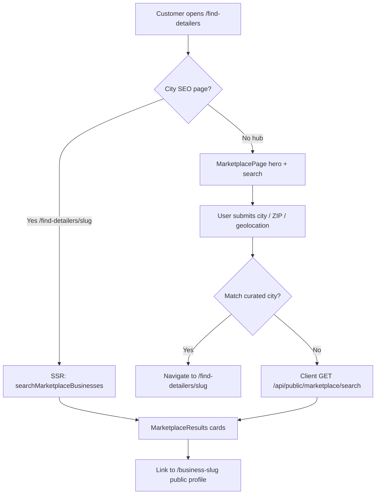

# Marketplace flows

Last updated: July 22, 2026

## What this feature is

Customers search for nearby **auto detailers** and open a public business profile to book. Soft-launch surface:

| Route                                          | Role                                            |
| ---------------------------------------------- | ----------------------------------------------- |
| `/find-detailers`                              | Hub — hero, search, marketing sections          |
| `/find-detailers/{city-slug}`                  | SEO city page — SSR listings for a curated city |
| `GET /api/public/marketplace/search?location=` | Client search API (rate-limited)                |

City slugs are defined in `config/marketplaceCities.ts` (e.g. `austin-tx` → search query `Austin, TX`).

---

## Feature flag

|         |                                                              |
| ------- | ------------------------------------------------------------ |
| Env     | `MARKETPLACE_PUBLIC_ENABLED=true` to expose public discovery |
| Default | Off                                                          |
| Helper  | `config/isMarketplacePublicEnabled.ts`                       |

When **off**:

1. Middleware redirects `/find-detailers` (+ city paths) home; marketplace public API → 404
2. Hub / city pages call `notFound()`
3. Search API returns 404 JSON
4. Nav / footer “Find detailers” links are omitted
5. Sitemap omits hub + city URLs; robots stay noindex for those pages when gated

Owner **service area collection** does **not** depend on this flag.

---

## End-to-end: customer search



### Hub (`MarketplacePage`)

1. Renders hero + `MarketplaceSearch` until a search has run (or `?location=` / city SSR seeds results).
2. On submit:
   - If query matches a curated city → `router.push` to that city URL (shareable SEO page).
   - If on a city page and query does **not** match that city → send to hub with `?location=`.
   - Else → client search via `api/searchMarketplace.ts`.
3. While fetching: results layout + **skeleton cards** (`MarketplaceResultsSkeleton`).
4. Cards: `MarketplaceResultCard` — adaptive 1/2/3 photo strip, logo, rating, area, location mode, “From $X”, View.

### City SEO page (`app/find-detailers/[city]/page.tsx`)

1. Resolve slug via `getMarketplaceCityBySlug`.
2. SSR call `searchMarketplaceBusinesses(city.searchQuery)`.
3. Pass `initialBusinesses` + `citySlug` into `MarketplacePage`.
4. Emit ItemList / CollectionPage JSON-LD; crawlable `sr-only` links to profiles.

### Shared search core

All listing paths go through **`server/searchMarketplaceBusinesses.ts`** (see [SEARCH_AND_DATA.md](./SEARCH_AND_DATA.md)).

---

## Folder layout

```
src/features/marketplace/
  api/           Client fetch wrapper for public search
  components/    Hub UI, search, results, cards, skeleton, marketing blocks
  config/        Flag, cities, listing denylist
  docs/          This documentation
  seo/           Hub + city JSON-LD builders
  server/        Search, geocode helper, haversine
  types/         MarketplaceBusiness + API response types
  index.ts       Public exports for app routes / nav
```

App wiring (not under the feature folder):

| Path                                             | Purpose                                            |
| ------------------------------------------------ | -------------------------------------------------- |
| `src/app/find-detailers/page.tsx`                | Hub route + metadata                               |
| `src/app/find-detailers/[city]/page.tsx`         | City route + SSR                                   |
| `src/app/api/public/marketplace/search/route.ts` | Public GET search                                  |
| `src/middleware.ts`                              | Gate paths when flag off                           |
| `src/app/sitemap.xml/route.ts`                   | Hub + city URLs when flag on                       |
| `src/constants/routes.ts`                        | `FIND_DETAILERS`, `FIND_DETAILERS_CITY`, API route |

---

## Soft-launch product rules (current)

- **Pro-only auto-inclusion** — no owner marketplace opt-in toggle yet.
- **No marketplace Pro badges on cards** — everyone listed is Pro; badge would be noise.
- **Manual denylist** — test/internal Auth emails excluded in `config/marketplaceListingDenylist.ts`.
- **Cities** — only curated metro cities get dedicated SEO URLs; expand when density exists.
- Ads / shares should land on `/find-detailers` or a city URL, not the marketing home.

---

## Deferred (do not assume shipped)

- Owner opt-in (“Show me to nearby customers”)
- Card chrome for “Travels up to X mi”
- PostGIS / geo index (V1 uses haversine in app code)
- Hard photo-quality gates for listing
- Free-tier marketplace listing
