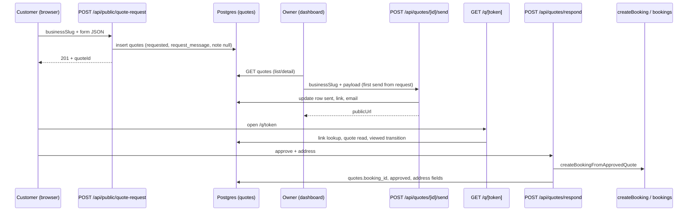

# Public quote request, send, view, approve → booking

This document describes how the **public quote request** path relates to **availability (public) booking**, how data moves through the system, and what happens when a customer **accepts** a quote (V2 `bookings` row). Use it with [README.md](./README.md), [QUOTES_TABLE.md](./QUOTES_TABLE.md), and [BOOKINGS_CUSTOMER_ID.md](./BOOKINGS_CUSTOMER_ID.md).

---

## 1. Two different “public customer” flows

| Flow                               | Entry (examples)                                                       | Auth                  | Primary API                             | Outcome                                                                                        |
| ---------------------------------- | ---------------------------------------------------------------------- | --------------------- | --------------------------------------- | ---------------------------------------------------------------------------------------------- |
| **Availability booking**           | `/:slug/book`, public book UI                                          | Customer (often anon) | `POST /api/public/bookings`             | `bookings` row + customer upsert + owner notify (same family as dashboard booking)             |
| **Quote request**                  | `/:businessSlug/quote` (e.g. `src/app/[business-slug]/quote/page.tsx`) | None                  | `POST /api/public/quote-request`        | `quotes` row only: `source = customer_requested`, `status = requested`, **no** public link yet |
| **Quoted job (after owner sends)** | Email/link `/q/[token]`                                                | Token                 | `GET` page + `POST /api/quotes/respond` | Quote lifecycle; on **approve** → **same booking stack** as public booking (see §6)            |

Quotes and bookings are **separate tables**. A quote becomes a booking only after the customer **approves** and server-side effects run successfully.

---

## 2. End-to-end: quote request → owner send → customer → booking

**First send from an open request** uses the same validated payload shape as **new quote send**, but updates the existing row and creates the link: `POST /api/quotes/[id]/send` (see main README / `sendExistingQuoteAsSent`).

---

## 3. Request intake data flow

### 3.1 UI

- **Component:** `public-request/components/PublicQuoteRequestScreen.tsx`
- **Route:** App renders `PublicQuoteRequestScreen` on `src/app/[business-slug]/quote/page.tsx` (slug passed as `businessSlug`).
- **Client call:** `fetch(API_ROUTES.PUBLIC_QUOTE_REQUEST)` → `/api/public/quote-request` (`src/constants/routes.ts`).

### 3.2 Server

| Step             | File / function                                       | Responsibility                                                                             |
| ---------------- | ----------------------------------------------------- | ------------------------------------------------------------------------------------------ |
| Validate body    | `public-request/validatePublicQuoteRequestBody.ts`    | `businessSlug`, contact, `serviceRequested`, optional vehicle, `timeline`, `details`, etc. |
| Resolve business | `src/app/api/public/quote-request/route.ts`           | `business_profiles` by `business_slug` → `businessId`                                      |
| Insert row       | `public-request/server/insertCustomerQuoteRequest.ts` | Admin client insert into `quotes`                                                          |

### 3.3 What gets stored on insert

- **`source`:** `customer_requested`
- **`status`:** `requested`
- **`requested_at`:** required for this source (DB constraint)
- **`request_message`:** built by `public-request/buildQuoteRequestNote.ts` from **timeline + details** (structured text: `Preferred timing: …` + blank lines + body). This is the **customer’s** message.
- **`note`:** `null` at intake — reserved for **owner** copy on the sent quote (`quotes.note`).
- **Defaults:** e.g. `price_cents`, `duration_minutes` placeholders until owner completes the quote.
- **No `quote_public_links` row** until the owner sends the quote.

### 3.4 Parsing customer text later

- **`parsePublicQuoteRequestNote`** (`dashboard/utils/parsePublicQuoteRequestNote.ts`): splits `request_message` (same format) into `preferredTiming` + `detailsOnly` for UI.
- **`resolveCustomerRequestRawText`** (`shared/resolveCustomerRequestRawText.ts`): reads `request_message`, or legacy fallback to `note` when old rows stored everything in `note`.

---

## 4. Owner dashboard flow (request → create quote → send)

| UI                                | Data                                                                                                                                                                       |
| --------------------------------- | -------------------------------------------------------------------------------------------------------------------------------------------------------------------------- |
| `QuoteRequestsDashboardPage`      | Lists `customer_requested` + `requested` (see `pendingCustomerQuoteRequests.ts`)                                                                                           |
| `QuoteRequestDetailScreen`        | Detail for one open request; `QuoteDetailContent` shows customer vs owner fields from `request_message` / `note`                                                           |
| `CreateQuoteScreen` `mode="edit"` | Hydrates **customer notes** from `request_message`, **Notes** field → `quotes.note`; schedule step can show **preferred timing** callout                                   |
| First send                        | `POST` `API_ROUTES.QUOTE_SEND_EXISTING(quoteId)` → `/api/quotes/[id]/send` → `sendExistingQuoteAsSent`: sets `sent`, link, email; does **not** overwrite `request_message` |

Subsequent edits to an already-sent quote use **`PATCH /api/quotes/[id]`** (owner `note` and other fields); `request_message` stays immutable in normal flows.

---

## 5. Public quote link (`/q/[token]`)

- **Page:** `src/app/q/[token]/page.tsx` (server, admin client for link + quote).
- **Lookup:** `quote_public_links.token_hash` via `resolveQuoteTokenHash(token)`.
- **Lifecycle:** May transition `sent` → `viewed` on load (atomic update when still `sent`).
- **Labels (customer-facing):** **Customer note** (from request text / parsed), **Notes from the business** (from `quotes.note`) — avoids “Your notes” sounding like the customer wrote it.
- **Actions:** `PublicQuoteRespondActions` → `POST /api/quotes/respond`.

---

## 6. Approve quote → booking (parity with public booking)

When the customer **approves**, `src/app/api/quotes/respond/route.ts` (with `finalizeApprovedQuoteToBooking` / `quoteApprovalSideEffects.ts`):

1. Persists structured **service address** on `quotes` (and legacy `service_address` where applicable).
2. Calls **`createBookingFromApprovedQuote`** (`server/createBookingFromApprovedQuote.ts`) → **`createBooking`** (same service path as availability bookings).
3. **Customer upsert** / `bookings.customer_id` — see [BOOKINGS_CUSTOMER_ID.md](./BOOKINGS_CUSTOMER_ID.md).
4. **Free-tier cap** — same check as `POST /api/public/bookings`.
5. **Time-off overlap** — same check as public booking.
6. **Owner notification** — reuses availability booking owner email / notification path (`notifyOwnerForAvailabilityBookingCreated`).
7. Sets **`quotes.booking_id`** when successful; idempotent repair if already `approved` but booking missing.

Booking **notes** can combine labeled **Customer note** + **Your notes** from the quote row for staff context (`createBookingFromApprovedQuote`).

---

## 7. Email: quote sent to customer

- **Trigger:** After `POST /api/quotes/send` (new row) or after `sendExistingQuoteAsSent` (first send from request).
- **Module:** `src/features/email/quote-sent-to-customer/`
- **Payload:** Includes optional **`customerRequestMessage`** (reference) and owner **`note`**; template sections **Customer note** / **Notes from the business** (aligned with public page wording).

---

## 8. Quick reference: routes & constants

| Concern                  | Location                                                                              |
| ------------------------ | ------------------------------------------------------------------------------------- |
| Dashboard paths          | `ROUTES.DASHBOARD.QUOTES_*`, `QUOTE_REQUEST_DETAIL`, etc. — `src/constants/routes.ts` |
| Public quote request API | `API_ROUTES.PUBLIC_QUOTE_REQUEST`                                                     |
| Send existing quote      | `API_ROUTES.QUOTE_SEND_EXISTING(id)` → `/api/quotes/[id]/send`                        |

---

## 9. When to update this doc

Update this file when you:

- Change **intake** fields or `request_message` / `note` semantics.
- Add steps between **requested** and **sent**, or change **approve → booking** side effects.
- Diverge quote approval from **public booking** rules (cap, time-off, notifications).

Also update [README.md](./README.md) API tables and [QUOTES_TABLE.md](./QUOTES_TABLE.md) if schema or statuses change.
