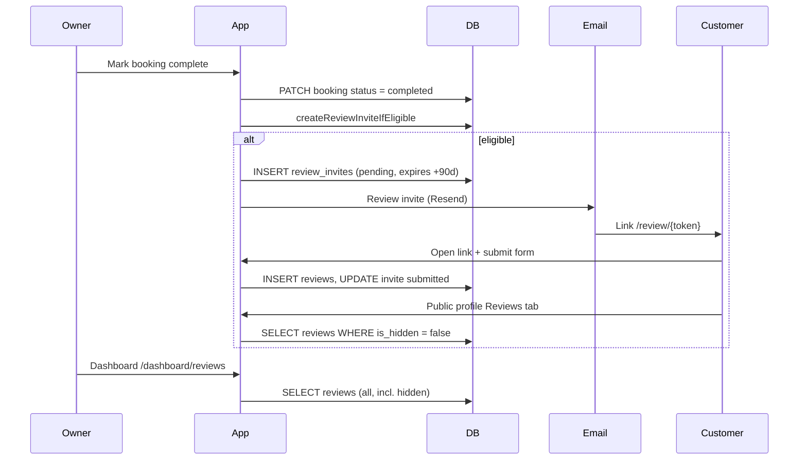

# Reviews — end-to-end flows

Human-readable reference for how the reviews feature works today: product rules, customer identity, APIs, UI surfaces, and data shapes. Use this for onboarding and AI context.

**Related docs**

| Doc | Use when |
|-----|----------|
| [DATABASE.md](./DATABASE.md) | Schema, RLS, tokens, SQL examples |
| [SERVER.md](./SERVER.md) | Server modules and loading strategy |
| [REVIEW_INVITES_TABLE.md](./REVIEW_INVITES_TABLE.md) | `review_invites` columns |
| [REVIEWS_TABLE.md](./REVIEWS_TABLE.md) | `reviews` columns |

---

## Overview

Reviews are **invite-only**. There is no owner-shareable review URL. After a **completed** V2 availability booking, the system may email the customer a **one-time magic link**. They submit stars + optional comment on `/review/[token]`. The owner sees reviews in the dashboard inbox and can reply. Visible reviews appear on the public business profile.



---

## Product rules (v1)

| Rule | Behavior |
|------|----------|
| **One review per customer per business** | At most one public review row per `(business_id, customer_id)`. Repeat completes do not send another invite if they already reviewed. |
| **One invite per booking** | `review_invites.booking_id` is unique. |
| **No duplicate pending invites** | At most one `pending` invite per `(business_id, customer_id)`. |
| **Email required to invite** | No customer email → invite skipped (booking can still complete). |
| **`customer_id` required to invite** | Booking must link to a `customers` row (set at booking create). |
| **No owner copy/share link** | Only hashed token in DB; raw token in email URL only. |
| **Owner cannot edit customer text** | Dashboard can reply and (future) hide; not edit body. |
| **Public profile** | Only `reviews` where `is_hidden = false`. |

**Invite eligibility** (server: `createReviewInviteIfEligible`, preview: `reviewInviteEligibility.ts`):

1. Valid normalized customer email on booking  
2. `customer_id` on booking  
3. No existing `reviews` row for `(business_id, customer_id)`  
4. No existing `pending` invite for `(business_id, customer_id)`  
5. No existing invite row for this `booking_id`  

Invite creation is **best-effort** on complete — failure does not roll back booking completion.

---

## Customer identity (not email/phone at review time)

“Already reviewed?” is keyed by **`customer_id`**, not by re-checking email or phone on the review page.

When a V2 booking is created, `upsertCustomerForBooking` (`customer-management/server/upsertCustomerForBooking.ts`):

1. Find customer by **normalized phone** (digits) for this business, if phone present  
2. Else find by **normalized email** (`lower(trim(email))`)  
3. Else insert new `customers` row  

That ID is stored on `bookings.customer_id`. Review invites and reviews reference the same ID.

**Dashboard complete modal** uses two flags from `GET /api/availability/bookings`:

| Field | Meaning |
|-------|---------|
| `customerAlreadyReviewed` | `reviews` exists for this booking’s `customer_id` |
| `willSendReviewInviteOnComplete` | Full server eligibility (email, id, no pending invite, etc.) |

Modal copy: show review-email message when `!customerAlreadyReviewed && hasEmail`; simple confirm when customer already reviewed.

---

## Review link lifecycle

| Setting | Value |
|---------|--------|
| Expiry | **90 days** from invite create (`INVITE_EXPIRY_DAYS` in `createReviewInviteIfEligible.ts`) |
| Auth | Possession of email link (raw token in URL); no OTP |
| Uses | **One** — after submit, invite `status = submitted` |
| Expired UX | Public error card: “Link expired” |
| Already submitted UX | “Already submitted” |

Validation: `loadPublicReviewInviteByToken` — hash token, require `status = pending`, `expires_at > now()`.

---

## API routes

| Method | Path | Auth | Purpose |
|--------|------|------|---------|
| `PATCH` | `/api/availability/bookings/[id]` | Owner | `status: completed` → `applyReviewInviteOnBookingCompleted` |
| `POST` | `/api/availability/bookings/[id]/review-invite` | Owner | Create invite + send email for a **completed** booking (mobile) |
| `GET` | `/api/availability/bookings` | Owner | Bookings list incl. `customerAlreadyReviewed`, `willSendReviewInviteOnComplete` |
| `GET` | `/api/reviews` | Owner | Dashboard inbox list |
| `PATCH` | `/api/reviews/[id]` | Owner | `{ ownerReplyBody }` or `null` to clear reply |
| `POST` | `/api/public/reviews/submit` | Public (token in body) | Customer submit `{ token, rating, body }` |
| `GET` | `/api/public/profile/[slug]/reviews` | Public | Full visible reviews (lazy tab) |

**Pages**

| Route | Role |
|-------|------|
| `/dashboard/reviews` | Owner inbox |
| `/dashboard/reviews/[reviewId]` | Owner detail (if routed) |
| `/review/[token]` | Customer invite form + success/error |
| `/[business-slug]` | Public profile; Reviews tab lazy-loads list |

---

## UI surfaces

### Owner dashboard (`src/features/reviews/dashboard/`)

- **`ReviewsDashboardPage`** — summary card, filter pills (All / Needs reply / Replied), list + inline reply  
- **`GET /api/reviews`** via `useDashboardReviews`  
- Loads **all** reviews including `is_hidden = true`  
- Reply: `PATCH /api/reviews/[id]`  

### Public profile (`src/features/business-profile/reviews/`)

- **SSR:** `loadPublicReviewSummary` — ratings only for header + tab visibility  
- **Tab click:** `LazyPublicReviewsSection` → `GET /api/public/profile/[slug]/reviews`  
- Loads **`is_hidden = false`** only  
- Summary: average, count, star breakdown via `deriveReviewsSummary`  

### Customer review page (`src/features/reviews/public/`)

- **`PublicReviewPageShell`** — form → success card  
- **`POST /api/public/reviews/submit`**  
- Copy: `public/copy/publicReviewCopy.ts`  

### Email (`src/features/email/review-invite/`)

- Template: dark glass card, gold star, white CTA  
- Subject: `How was your visit with {businessName}?`  
- Sent via Resend when invite is created (best-effort)  

---

## Database tables (summary)

### `review_invites`

Created on booking complete when eligible. Stores **`link_token_hash`** only (SHA-256 hex of raw token).

Key columns: `business_id`, `booking_id`, `customer_id`, `status` (`pending` | `submitted` | `expired` | `cancelled`), `expires_at`, `email_sent_at`.

See [REVIEW_INVITES_TABLE.md](./REVIEW_INVITES_TABLE.md).

### `reviews`

Created on customer submit.

Key columns: `business_id`, `booking_id`, `review_invite_id`, `customer_id`, `rating` (1–5), `body`, `author_display_name`, `is_hidden`, `owner_reply_body`, `owner_replied_at`.

Unique: one review per `(business_id, customer_id)` when `customer_id` is set.

See [REVIEWS_TABLE.md](./REVIEWS_TABLE.md).

Full ER diagram and RLS: [DATABASE.md](./DATABASE.md).

---

## Data loading — what we SELECT

### Dashboard — `loadDashboardReviews`

```sql
-- Conceptual
SELECT id, author_display_name, rating, body, created_at,
       owner_reply_body, owner_replied_at, is_hidden
FROM reviews
WHERE business_id = :ownerBusinessId
ORDER BY created_at DESC
LIMIT 100;
```

Maps to **`DashboardReview`** = `PublicProfileReview` + `isHidden`.

### Public profile (full tab) — `loadPublicBusinessReviews`

```sql
SELECT id, author_display_name, rating, body, created_at,
       owner_reply_body, owner_replied_at
FROM reviews
WHERE business_id = :businessId AND is_hidden = false
ORDER BY created_at DESC
LIMIT 50;
```

Plus in-memory **`PublicProfileReviewsSummary`** (average, count, breakdown).

### Public profile (SSR summary) — `loadPublicReviewSummary`

```sql
SELECT rating FROM reviews
WHERE business_id = :businessId AND is_hidden = false
LIMIT 50;
```

No bodies — cheap header/tab gate.

### Booking list — review flags — `loadReviewInviteEligibilityContext`

Batch for all bookings on load:

- `reviews.customer_id` for business → `customerAlreadyReviewed` per booking  
- Pending `review_invites` per customer  
- Existing invites per `booking_id`  
- Composed into `willSendReviewInviteOnComplete` per row  

---

## App types (TypeScript)

### `PublicProfileReview` (`types/publicProfile.ts`)

```ts
{
  id: string;
  authorDisplayName: string;
  rating: number;        // 1–5
  body: string;
  createdAt: string;     // ISO
  ownerReply?: { body: string; repliedAt: string };
}
```

### `DashboardReview`

`PublicProfileReview & { isHidden: boolean }`

### `PublicProfileReviewsData`

```ts
{ reviews: PublicProfileReview[]; summary: PublicProfileReviewsSummary }
```

### Submit body (`validateSubmitReviewBody`)

```ts
{ token: string; rating: number; body?: string }  // body max 2000 chars
```

---

## Mobile — review invite email

Mobile updates bookings directly in Supabase. After marking a booking **completed**, call this API when your local eligibility checks pass (same rules as web: customer email, `customer_id`, no existing review).

**`POST /api/availability/bookings/{bookingId}/review-invite`**

- **Auth:** Owner session (same JWT as other dashboard APIs)
- **Precondition:** Booking `status = completed` (returns 400 otherwise)
- **Idempotent:** Safe to call if web already sent on PATCH complete — skips with `reason`

**Success — email sent**

```json
{ "success": true, "sent": true, "skipped": false, "inviteId": "uuid" }
```

**Success — skipped (not eligible or already invited)**

```json
{ "success": true, "sent": false, "skipped": true, "reason": "customer_already_reviewed" }
```

`reason` values: `no_customer_email` | `no_customer_id` | `invite_already_exists` | `customer_already_reviewed` | `pending_invite_exists`

**Success — invite created, email failed (best-effort)**

```json
{ "success": true, "sent": false, "skipped": false, "inviteId": "uuid" }
```

**Errors:** `401` / `404` / `500` → `{ "success": false, "error": "..." }`

Responses include **`X-Request-ID`** for tracing. Structured logs use prefix **`[review-invite]`** (`reviewInviteRouteLog.ts`).

Server helper: `requestReviewInviteForBooking` in `src/features/reviews/server/`.

**Mobile integration contract (copy to Expo AI):** [docs/contracts/mobile-review-invite-on-complete.md](../../../docs/contracts/mobile-review-invite-on-complete.md)

---

## Environment

| Variable | Used for |
|----------|----------|
| `RESEND_API_KEY` | Review invite email |
| `SITE_URL` / `NEXT_PUBLIC_SITE_URL` | Absolute `/review/{token}` in email |

---

## Code map

```
src/features/reviews/
  docs/           ← you are here
  server/         createReviewInviteIfEligible, requestReviewInviteForBooking, submit, public loaders
  dashboard/      owner UI + loadDashboardReviews, PATCH reply
  public/         customer /review UI
  utils/          token hash, summary, API paths
  types/          publicProfile, loadResults

src/features/business-profile/reviews/   public profile tab UI
src/features/email/review-invite/        HTML + plain-text email

src/app/api/reviews/                     owner APIs
src/app/api/public/reviews/submit/       customer submit
src/app/api/public/profile/[slug]/reviews/
src/app/review/[token]/page.tsx
src/app/api/availability/bookings/[id]/  complete → invite hook
```

---

## Not built / deferred

| Item | Notes |
|------|--------|
| Owner resend invite | Manual workaround: contact customer with support |
| SMS invite | Email only v1 |
| Receipt + review combined email | Complete sends review invite only |
| `is_hidden` toggle in dashboard UI | API may support; UI TBD |
| Background job to set `review_invites.status = expired` | Expiry enforced at read time via `expires_at` |
| OTP / code before review | Magic link only; likely unnecessary friction |

---

## Testing (entry points)

| Area | Tests |
|------|--------|
| Invite eligibility | `testing/reviewInviteEligibility.test.ts`, `createReviewInviteIfEligible.test.ts` |
| Submit validation | `testing/validateSubmitReviewBody.test.ts` |
| Email template | `features/email/testing/reviewInviteTemplate.test.ts` |
| Dashboard API | `dashboard/testing/reviewsRouteGet.test.ts`, `reviewsRoutePatch.test.ts` |
| Public form | `public/testing/PublicReviewForm.test.ts` |
| Complete modal | `availability/booking/testing/availabilityBookingDetailPanelComplete.test.ts` |
