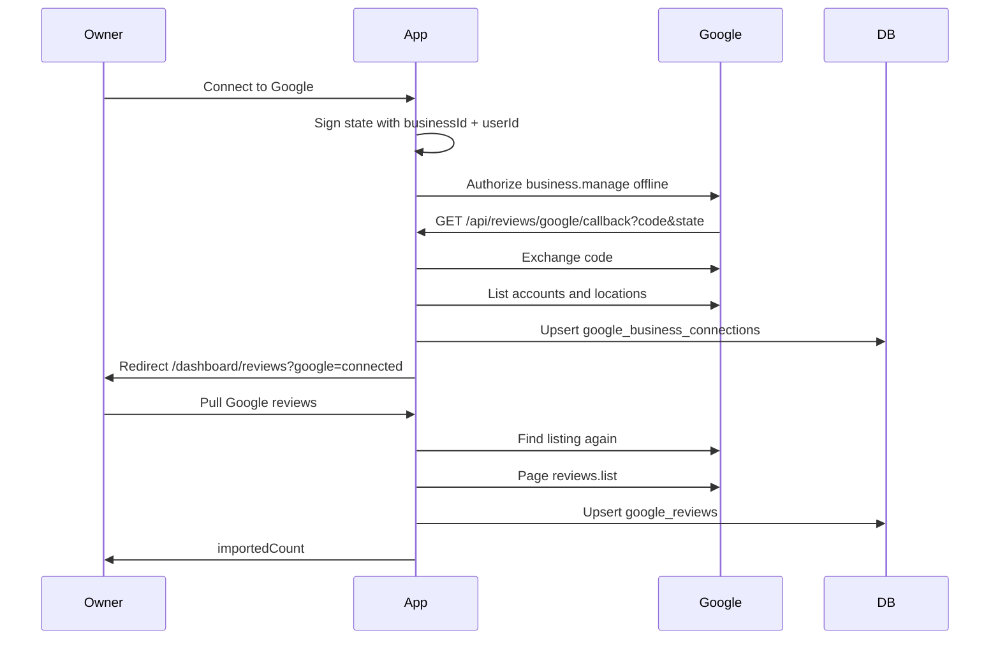

# Google reviews — import and display

Owners can show **all** of their Google Business Profile reviews on their ServiceLink public page. This is a **second source** next to ServiceLink-native reviews (invite after a completed job). It is not a replacement for those invites.

**Related:** [FLOWS.md](./FLOWS.md) (native invite flow), [DATABASE.md](./DATABASE.md), [SERVER.md](./SERVER.md).

---

## Product

| In v1 | Out of v1 |
| ----- | --------- |
| Owner connects the Google account that manages their listing | Places API (~5 public reviews, no caching of bodies) |
| One click pulls every Google review we can page | Dumping Google rows into `reviews` (`booking_id` / `review_invite_id`) |
| Reviews show in the dashboard inbox and public Reviews tab | Owner reply / hide from ServiceLink |
| ServiceLink star average stays ServiceLink-only | Sending customers to Google after a job |
| Google reviews are labeled **Google** | Multi-listing picker |

**Owner flow**

1. `/dashboard/reviews` → **Connect to Google** → Google OAuth.
2. **Pull Google reviews** → we find the listing and import reviews.

There is no “find my listing” step in the UI. Listing lookup is server-side inside pull (and also attempted on the OAuth callback).

---

## How we know which listing to pull

Two IDs, neither typed by the owner:

| ID | Source |
| -- | ------ |
| ServiceLink `business_id` | Signed-in dashboard session (`resolveCurrentBusinessId`). Stored in signed OAuth `state` at Connect. |
| Google location | The Google account they just authorized. We list accounts, then locations, and take the **first** location Google returns. |

If that Google account manages more than one listing, we silently use the first. A picker is only needed later for multi-location owners.

Connect can succeed even when listing lookup fails (quota 0). Pull retries lookup, then pages reviews.

---

## Owner UI

Card: `ReviewsGoogleConnectCard` on `ReviewsDashboardPage`. Copy: `dashboard/copy/googleConnectCopy.ts`. Hook: `useGoogleBusinessConnection`.

| State | What they see |
| ----- | ------------- |
| Not connected | Connect explanation + **Connect to Google** |
| Connected, no pull yet | **Pull Google reviews** |
| Pull succeeded | Imported count + Pull again (refresh) |
| Pull failed | Error under the button (quota, no listing, Google error) |

Google rows in the inbox have `source: 'google'`. They are excluded from **Needs reply** and have no reply UI.

---

## Public profile

| Surface | Behavior |
| ------- | -------- |
| Header stars | ServiceLink `reviews` only. Google does not change the average. |
| Reviews tab | Shown if ServiceLink **or** imported Google count > 0 (`publicGoogleReviewCount`). |
| Tab list | ServiceLink reviews + `googleReviews` / `googleSummary` as a separate list. Cards show a **Google** label. Star-only Google reviews omit an empty body. |

SSR summary stays ServiceLink-only. Google count is loaded separately so the tab can appear when only Google reviews exist.

---

## APIs

Routes live in `src/constants/routes.ts`. Do not hardcode paths.

| Method | Route | Auth | Purpose |
| ------ | ----- | ---- | ------- |
| `POST` | `/api/reviews/google/connect` | Owner | Start OAuth. Returns `{ url }` to Google. |
| `GET` | `/api/reviews/google/callback` | Owner + signed `state` | Exchange code, save tokens, try listing lookup, redirect to Reviews. |
| `GET` | `/api/reviews/google/status` | Owner | `{ connected }` only. Tokens never leave the server. |
| `POST` | `/api/reviews/google/sync` | Owner | Find listing and save account/location names. Used by pull; not shown in the UI. |
| `POST` | `/api/reviews/google/pull` | Owner | Sync listing, page all Google reviews, upsert `google_reviews`. Returns `{ importedCount }`. |

**Also merged into existing routes**

| Method | Route | Change |
| ------ | ----- | ------ |
| `GET` | `/api/reviews` | ServiceLink inbox + Google rows, newest first. |
| `GET` | `/api/public/profile/[slug]/reviews` | Adds `googleReviews` and `googleSummary`. Does not mix averages. |

---

## Server modules

`src/features/reviews/google-connect/server/`

| Module | Role |
| ------ | ---- |
| `googleBusinessOAuth.ts` | Client env, redirect URI, authorize URL, `business.manage` scope |
| `googleConnectState.ts` | Signed OAuth state (`businessId`, `userId`, expiry) |
| `startGoogleBusinessConnect.ts` | Build authorize URL + httpOnly nonce cookie `sl_gbp_oauth` |
| `exchangeGoogleBusinessCode.ts` | Auth code → tokens |
| `refreshGoogleAccessToken.ts` | Refresh when access token is expired |
| `getGoogleAccessTokenForBusiness.ts` | Load connection, refresh if needed |
| `fetchGoogleBusinessLocations.ts` | Accounts + locations; first location wins |
| `upsertGoogleBusinessConnection.ts` | One row per `business_id` |
| `syncGoogleBusinessListing.ts` | Token → location pick → save names |
| `pullGoogleBusinessReviews.ts` | Sync, then `GET …/v4/{parent}/reviews` (page size 50) |
| `googleReviewsParentName.ts` | `accounts/…/locations/…` parent path |
| `googleReviewStarRating.ts` | `ONE`–`FIVE` → 1–5 |
| `mapGoogleReviewToPublic.ts` | Google API row → DB + public card |
| `loadGoogleBusinessConnectionStatus.ts` | Connected? (no tokens) |
| `loadGoogleReviews.ts` | Public + dashboard reads from `google_reviews` |

---

## Connect sequence



OAuth: `access_type=offline`, `prompt=consent`, scope `https://www.googleapis.com/auth/business.manage`.

Redirect URIs must match the Cloud client exactly:

- `http://localhost:3000/api/reviews/google/callback`
- `https://myservicelink.app/api/reviews/google/callback`

---

## Google Cloud setup

This is **not** Login with Google (Supabase Auth). Use a separate OAuth web client.

**Env (server only)**

- `GOOGLE_BUSINESS_CLIENT_ID`
- `GOOGLE_BUSINESS_CLIENT_SECRET`

Restart `next dev` after changing `.env.local`.

**APIs to enable** on the ServiceLink Cloud project:

1. My Business Account Management API
2. My Business Business Information API
3. Google My Business API (v4 reviews) — may stay hidden until Google approves the project

**Quota gate:** new projects start at **Requests per minute = 0**. Connect can still store tokens. Pull and listing lookup return **429** until Google grants quota (typically **300**). Check **APIs & Services → My Business Account Management API → Quotas**, not the traffic graph.

Google’s Basic API Access form wants a **verified listing live 60+ days** and the Cloud **project number** (digits), not the project id string.

When quota is live: Reviews → **Pull Google reviews**. Confirm rows in the inbox (Google label) and the public Reviews tab.

---

## Database

Do **not** insert Google reviews into `reviews`. That table is invite/booking-backed.

Migrations (run in order after the native review migrations):

| File | Table |
| ---- | ----- |
| [`migrations/004_google_business_connections.sql`](./migrations/004_google_business_connections.sql) | `google_business_connections` |
| [`migrations/005_google_reviews.sql`](./migrations/005_google_reviews.sql) | `google_reviews` |

Both tables: RLS on, **service role only**. Tokens never go to `anon` / `authenticated`.

### `google_business_connections`

One row per ServiceLink business.

| Column | Notes |
| ------ | ----- |
| `business_id` | Unique FK → `business_profiles` |
| `google_account_name` | e.g. `accounts/123` |
| `google_location_name` | e.g. `locations/456` |
| `google_location_title` | Display title from Google |
| `refresh_token` | Required; server only |
| `access_token` / `access_token_expires_at` | Refreshed as needed |
| `scopes` | Default `business.manage` |
| `last_synced_at` | Set after a successful pull |

### `google_reviews`

| Column | Notes |
| ------ | ----- |
| `business_id` | FK → `business_profiles` |
| `provider_review_id` | Google review id; unique with `business_id` |
| `rating` | 1–5 |
| `body` | Empty string allowed (star-only) |
| `author_display_name` / `author_photo_url` / `is_anonymous` | From Google reviewer |
| `provider_create_time` / `provider_update_time` | Google timestamps |
| `owner_reply_body` / `owner_replied_at` | Copied from Google if present. Read-only in ServiceLink. |

Pull upserts on `(business_id, provider_review_id)`. Re-pull refreshes existing rows.

---

## Display types

`PublicProfileReview.source`: `'servicelink'` | `'google'`.

Google public ids are `google:{providerReviewId}` (import) or `google:{row.id}` (load). Dashboard Google rows set `isHidden: false` (no hide UI yet).

```ts
{
  reviews: PublicProfileReview[];       // ServiceLink
  summary: PublicProfileReviewsSummary; // ServiceLink only
  googleReviews?: PublicProfileReview[];
  googleSummary?: PublicProfileReviewsSummary | null;
}
```

---

## Not built yet

- Disconnect / revoke
- Multi-listing picker
- Scheduled / cron pull
- Reply or hide Google reviews from ServiceLink
- Mixing Google stars into the public header average

---

## Code map

| Path | Role |
| ---- | ---- |
| `src/features/reviews/google-connect/` | OAuth, sync, pull, mappers, tests |
| `src/app/api/reviews/google/*` | Connect, callback, status, sync, pull |
| `src/features/reviews/dashboard/components/cards/ReviewsGoogleConnectCard.tsx` | Owner card |
| `src/features/business-profile/reviews/` | Public cards + lazy tab |
