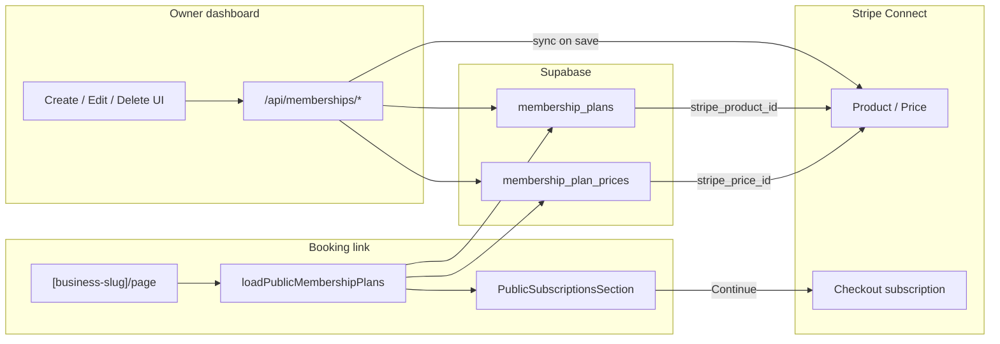

# Memberships — flows (save, pull, UX)

End-to-end behavior for owner dashboard and public booking link. Pair with [DATABASE.md](./DATABASE.md) for columns.

---

## Access gates

Resolved by `loadMembershipsAccess` / `assertMembershipsReady`:

```
not_in_rollout → not_pro → needs_connect → needs_payments → ready
```

| Gate             | Meaning                                            | UI                                |
| ---------------- | -------------------------------------------------- | --------------------------------- |
| `not_in_rollout` | Owner email not on allowlist (and open-to-all off) | Redirect `/dashboard`; nav hidden |
| `not_pro`        | No Pro entitlement                                 | `SubscriptionsNotProGate`         |
| `needs_connect`  | Stripe Connect incomplete / charges not enabled    | `SubscriptionsConnectGate`        |
| `needs_payments` | `payment_settings.payments_enabled` false          | `SubscriptionsPaymentsGate`       |
| `ready`          | Can manage plans                                   | Create-first or plan list         |

**Rollout config:** `config/membershipsRolloutAllowlist.ts`

- `MEMBERSHIPS_ROLLOUT_OWNER_EMAILS` — lowercase auth emails
- `MEMBERSHIPS_ROLLOUT_OPEN_TO_ALL` — `true` = everyone with Pro/Connect/payments

Gated surfaces: dashboard nav + routes, write APIs, public Subscriptions tab (via owner email check in `isBusinessInMembershipsRollout`).

---

## Owner dashboard routes

| Constant                         | Path                                        |
| -------------------------------- | ------------------------------------------- |
| `ROUTES.DASHBOARD.SUBSCRIPTIONS` | `/dashboard/subscriptions`                  |
| `SUBSCRIPTIONS_NEW`              | `/dashboard/subscriptions/new`              |
| `SUBSCRIPTIONS_DETAIL(planId)`   | `/dashboard/subscriptions/[planId]`         |
| `SUBSCRIPTIONS_EDIT(planId)`     | `/dashboard/subscriptions/[planId]/edit`    |
| `SUBSCRIPTIONS_SUBSCRIBER(id)`   | `/dashboard/subscriptions/subscribers/[id]` |

Central definitions: `src/constants/routes.ts`.

### Ready UI phases

1. **0 plans** → create-first empty state → `/new`
2. **≥1 plan** → Plans | Subscribers tabs
   - Plans: cards → detail
   - Subscribers: empty until memberships table exists

---

## HTTP APIs

| Method   | Path                              | Purpose                                 |
| -------- | --------------------------------- | --------------------------------------- |
| `GET`    | `/api/memberships`                | List owner plans (non-deleted)          |
| `POST`   | `/api/memberships/plans`          | Create plan + prices                    |
| `PATCH`  | `/api/memberships/plans/[planId]` | Update plan + sync prices               |
| `DELETE` | `/api/memberships/plans/[planId]` | Soft-delete (409 if active subscribers) |

Constants: `API_ROUTES.MEMBERSHIPS`, `MEMBERSHIPS_PLANS`, `MEMBERSHIPS_PLAN(id)`.

**Auth:** Supabase session + `resolveCurrentBusinessId`.  
**Writes:** also `assertMembershipsReady` (403 + `gate` if not ready).

### Write body (create + update)

```json
{
  "name": "Monthly Detail Club",
  "description": "Keep the car looking fresh.\n• Interior wipe-down\n• Exterior wash",
  "cadenceOptions": [
    { "intervalUnit": "week", "intervalCount": 1, "priceCents": 4900 },
    { "intervalUnit": "month", "intervalCount": 1, "priceCents": 15900 }
  ]
}
```

Validated by `parseMembershipPlanWriteBody`:

- `name` required
- ≥1 cadence; `intervalUnit` ∈ week|month|year; `intervalCount` ≥ 1; `priceCents` > 0
- No duplicate `(intervalUnit, intervalCount)` pairs

---

## What we save (owner create / edit)

### Create — `createMembershipPlanForBusiness`

| Destination              | Fields written                                                                                                                                      |
| ------------------------ | --------------------------------------------------------------------------------------------------------------------------------------------------- |
| `membership_plans`       | `business_id`, `name`, `description`, `benefits` (from split), `is_published: true`, `is_popular: false`, `sort_order: 0`, then `stripe_product_id` |
| `membership_plan_prices` | one row per cadence: `interval_*`, `price_cents`, `currency: 'usd'`, `is_default` (first = true), then `stripe_price_id`                            |
| Stripe Connect           | Product + Price(s) via `syncMembershipPlanStripeCatalog`                                                                                            |

Order: resolve Connect account → insert DB → Stripe sync → store IDs.  
If price insert **or** Stripe sync fails → plan row **hard-deleted** (cascade prices).

### Update — `updateMembershipPlanForBusiness`

| Destination | Behavior                                                                                                                   |
| ----------- | -------------------------------------------------------------------------------------------------------------------------- |
| Plan row    | Update name / description / benefits (always allowed)                                                                      |
| Prices      | Match by `interval_unit:interval_count`; update cents + default; **insert** new cadences; **hard-delete** removed cadences |
| Stripe      | Re-sync Product; new Price when amount/interval no longer matches; archive removed cadence Prices (best-effort)            |

**Subscriber safety (edit):**

| Change                     | If customers subscribed                                                                            |
| -------------------------- | -------------------------------------------------------------------------------------------------- |
| Name / description         | Allowed (Stripe Product updated)                                                                   |
| Add cadence                | Allowed                                                                                            |
| Change amount on a cadence | Allowed — new Stripe Price for **new** checkouts; existing Stripe Subscribers keep their old Price |
| Remove a cadence           | **Blocked** if that price row has active subscribers (`countActivePriceSubscribers`)               |

If Stripe sync fails after DB update → API returns error (owner can retry edit).

### Delete — `deleteMembershipPlanForBusiness`

1. Ensure plan exists and `deleted_at` is null
2. `countActivePlanSubscribers` — if `> 0`, fail with `has_subscribers` (409)
3. Set `deleted_at = now()`

**UI:** Delete opens a confirm modal only when `activeSubscriberCount === 0`. If there are subscribers, the modal explains delete is blocked (no Delete action).

**Policy:** soft-delete in DB (`deleted_at`); never auto-cancel Stripe members. After soft-delete, archive Stripe Product + Prices (`active: false`) on the connected account (best-effort). Stripe objects are not hard-deleted; IDs stay on our rows.

Stub today: plan/price subscriber counters always return `0`.

---

## What we pull

### Owner list / detail

| Loader                         | Client       | Filter                                                 | Returns                                   |
| ------------------------------ | ------------ | ------------------------------------------------------ | ----------------------------------------- |
| `loadOwnerMembershipsState`    | User session | `deleted_at IS NULL`, order `sort_order`, `created_at` | `OwnerSubscriptionPlan[]` (+ access gate) |
| `getMembershipPlanForBusiness` | User session | id + business + not deleted                            | Single plan + prices                      |

Used by dashboard pages (server components) and `GET /api/memberships`.

### Public booking link

| Loader                      | Client    | Conditions                                                                   | Returns                      |
| --------------------------- | --------- | ---------------------------------------------------------------------------- | ---------------------------- |
| `loadPublicMembershipPlans` | **Admin** | Owner in rollout + has Pro; plans `is_published` + not deleted; ≥1 price row | `CustomerSubscriptionPlan[]` |

Called from `src/app/[business-slug]/page.tsx` → `BusinessProfileView` → `PublicSubscriptionsSection`.

**Tab visibility:** Subscriptions tab only if returned array is non-empty.

---

## Owner UX flows

### Create

```
/subscriptions → /new
  wizard: name → cadence(s)+price → description
  POST /api/memberships/plans
  success screen → list (refresh)
```

Component: `CreateSubscriptionPlanPage` (`mode: 'create'`).

### Edit

```
/subscriptions/[planId] → Edit → /edit
  hydrate textarea via joinDescriptionAndBenefits
  PATCH /api/memberships/plans/[planId]
  → detail
```

Same wizard (`mode: 'edit'`).

### Delete

```
Plan detail → Delete → DeleteMembershipPlanModal
  DELETE /api/memberships/plans/[planId]
  toast → /subscriptions
```

Errors (e.g. future “has subscribers”) show inside the modal.

---

## Public UX flow

```
Booking link → Subscriptions tab
  → SubscriptionPlanCard (price, cadences, description)
  → Subscribe → SubscribePlanDetailsModal
  → Continue
       → POST /api/public/memberships/checkout
       → Stripe Checkout (mode: subscription) on Connect account
       → return /{slug}?membershipCheckout=success&planId&priceId&session_id
       → EchoBars loading → PublicMembershipSubscribeSuccess (server-rendered; no profile flash)
       → Done → /{slug}?tab=subscriptions
       → cancel → profile + toast warning
```

Body: `{ businessSlug, planId, priceId }` (`priceId` = `membership_plan_prices.id`).  
Requires published plan, `stripe_price_id`, Pro + rollout + payments enabled + Connect ready.

**Webhook (live):** Connect `/api/stripe/webhook-connect` → `customer_memberships` + `membership_events` (+ invoices on `invoice.paid` / `invoice.payment_failed`).

**Live:** owner Subscribers list/detail from `customer_memberships`; confirmation email with signed **Manage or cancel** → Connect Customer Portal.

**Still TODO:** richer receipt / invoice emails; owner “resend manage link” polish if needed.

---

## Data flow diagram (current)



---

## Transactional logging

`membershipsTransactionLog.ts` — **warn/error only** (success is silent). Correlate with response `X-Request-ID`.

Each failure includes a short `reason` plus safe ids (`businessId`/`planId` truncated, shortened Stripe ids) and Stripe `type` / `code` / `requestId` when present. No PII. Full Stripe/Supabase messages only outside production.

## Server module cheat sheet

| File                                         | Role                                                   |
| -------------------------------------------- | ------------------------------------------------------ |
| `loadMembershipsAccess.ts`                   | Gate flags for UI                                      |
| `assertMembershipsReady.ts`                  | API hard gate                                          |
| `getBusinessStripeConnectAccountId.ts`       | Connect `acct_…` for catalog sync                      |
| `membershipsTransactionLog.ts`               | Structured logs + `X-Request-ID`                       |
| `membershipTablesQuery.ts`                   | Typed-enough `.from('membership_*')` helpers           |
| `syncMembershipPlanStripeCatalog.ts`         | Product + Price create/update; archive removed Prices  |
| `isBusinessInMembershipsRollout.ts`          | Email allowlist for business                           |
| `loadOwnerMembershipsState.ts`               | Owner plans + access                                   |
| `loadPublicMembershipPlans.ts`               | Public catalog                                         |
| `createMembershipPlan.ts`                    | Insert plan + prices + Stripe sync (rollback on fail)  |
| `updateMembershipPlan.ts`                    | Patch + DB prices + Stripe sync                        |
| `deleteMembershipPlan.ts`                    | Soft-delete + subscriber check                         |
| `countActivePlanSubscribers.ts`              | Plan + price active counts from `customer_memberships` |
| `applyMembershipCheckoutSessionCompleted.ts` | Connect checkout → member row                          |
| `applyMembershipSubscriptionLifecycle.ts`    | subscription.updated / deleted                         |
| `applyMembershipInvoiceEvent.ts`             | invoice.paid / payment_failed                          |
| `parseMembershipPlanWriteBody.ts`            | Shared create/update validation                        |
| `mapMembershipPlanRow.ts`                    | DB row → app types                                     |
| `utils/planDescription.ts`                   | split / join description + benefits                    |

---

## Stripe catalog sync (live)

On create/edit (`syncMembershipPlanStripeCatalog` via `getStripeConnectClient`):

1. Resolve Connect account from `payment_accounts`
2. Create or update Stripe **Product** → `membership_plans.stripe_product_id`
3. Create Stripe **Price** per cadence (or new Price if amount/interval changed) → `membership_plan_prices.stripe_price_id`
4. Removed cadences: archive old Stripe Price (`active: false`) best-effort, then hard-delete DB row

## Checkout + Connect webhook (live)

1. Public Continue → `createPublicMembershipCheckoutSession`
2. Checkout Session `mode: 'subscription'`, stored `stripe_price_id`, `{ stripeAccount }`
3. Metadata `kind: membership_checkout` (+ plan/price/business ids) on session + subscription
4. Connect webhook (`checkout.session.completed`) → upsert `customer_memberships` + `checkout_completed` event
5. `customer.subscription.updated` / `deleted` → sync status / cancel fields
6. `invoice.paid` / `invoice.payment_failed` → `membership_invoices` + member payment health
7. **Still TODO:** receipt emails, Customer Portal, owner Subscribers UI from live data
