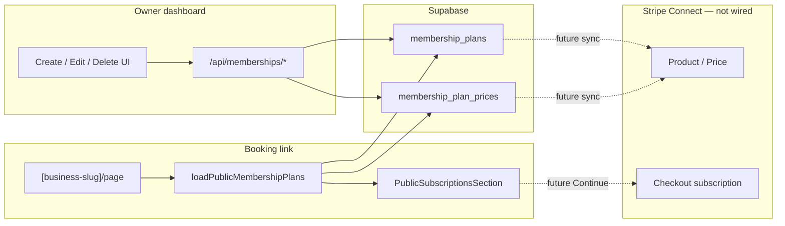

# Memberships — flows (save, pull, UX)

End-to-end behavior for owner dashboard and public booking link. Pair with [DATABASE.md](./DATABASE.md) for columns.

---

## Access gates

Resolved by `loadMembershipsAccess` / `assertMembershipsReady`:

```
not_in_rollout → not_pro → needs_connect → needs_payments → ready
```

| Gate | Meaning | UI |
| ---- | ------- | -- |
| `not_in_rollout` | Owner email not on allowlist (and open-to-all off) | Redirect `/dashboard`; nav hidden |
| `not_pro` | No Pro entitlement | `SubscriptionsNotProGate` |
| `needs_connect` | Stripe Connect incomplete / charges not enabled | `SubscriptionsConnectGate` |
| `needs_payments` | `payment_settings.payments_enabled` false | `SubscriptionsPaymentsGate` |
| `ready` | Can manage plans | Create-first or plan list |

**Rollout config:** `config/membershipsRolloutAllowlist.ts`

- `MEMBERSHIPS_ROLLOUT_OWNER_EMAILS` — lowercase auth emails
- `MEMBERSHIPS_ROLLOUT_OPEN_TO_ALL` — `true` = everyone with Pro/Connect/payments

Gated surfaces: dashboard nav + routes, write APIs, public Subscriptions tab (via owner email check in `isBusinessInMembershipsRollout`).

---

## Owner dashboard routes

| Constant | Path |
| -------- | ---- |
| `ROUTES.DASHBOARD.SUBSCRIPTIONS` | `/dashboard/subscriptions` |
| `SUBSCRIPTIONS_NEW` | `/dashboard/subscriptions/new` |
| `SUBSCRIPTIONS_DETAIL(planId)` | `/dashboard/subscriptions/[planId]` |
| `SUBSCRIPTIONS_EDIT(planId)` | `/dashboard/subscriptions/[planId]/edit` |
| `SUBSCRIPTIONS_SUBSCRIBER(id)` | `/dashboard/subscriptions/subscribers/[id]` |

Central definitions: `src/constants/routes.ts`.

### Ready UI phases

1. **0 plans** → create-first empty state → `/new`
2. **≥1 plan** → Plans | Subscribers tabs  
   - Plans: cards → detail  
   - Subscribers: empty until memberships table exists

---

## HTTP APIs

| Method | Path | Purpose |
| ------ | ---- | ------- |
| `GET` | `/api/memberships` | List owner plans (non-deleted) |
| `POST` | `/api/memberships/plans` | Create plan + prices |
| `PATCH` | `/api/memberships/plans/[planId]` | Update plan + sync prices |
| `DELETE` | `/api/memberships/plans/[planId]` | Soft-delete (409 if active subscribers) |

Constants: `API_ROUTES.MEMBERSHIPS`, `MEMBERSHIPS_PLANS`, `MEMBERSHIPS_PLAN(id)`.

**Auth:** Supabase session + `resolveCurrentBusinessId`.  
**Writes:** also `assertMembershipsReady` (403 + `gate` if not ready).

### Write body (create + update)

```json
{
  "name": "Monthly Detail Club",
  "description": "Keep the car looking fresh.\n• Interior wipe-down\n• Exterior wash",
  "cadenceOptions": [
    { "intervalUnit": "week", "intervalCount": 1, "priceCents": 4900 },
    { "intervalUnit": "month", "intervalCount": 1, "priceCents": 15900 }
  ]
}
```

Validated by `parseMembershipPlanWriteBody`:

- `name` required
- ≥1 cadence; `intervalUnit` ∈ week|month|year; `intervalCount` ≥ 1; `priceCents` > 0
- No duplicate `(intervalUnit, intervalCount)` pairs

---

## What we save (owner create / edit)

### Create — `createMembershipPlanForBusiness`

| Destination | Fields written |
| ----------- | -------------- |
| `membership_plans` | `business_id`, `name`, `description`, `benefits` (from split), `is_published: true`, `is_popular: false`, `sort_order: 0` |
| `membership_plan_prices` | one row per cadence: `interval_*`, `price_cents`, `currency: 'usd'`, `is_default` (first = true) |

**Not written:** `stripe_product_id`, `stripe_price_id` (stay null until Stripe sync).

If price insert fails → plan row hard-deleted (rollback).

### Update — `updateMembershipPlanForBusiness`

| Destination | Behavior |
| ----------- | -------- |
| Plan row | Update name / description / benefits |
| Prices | Match by `interval_unit:interval_count`; update cents + default; **insert** new cadences; **hard-delete** removed cadences |

### Delete — `deleteMembershipPlanForBusiness`

1. Ensure plan exists and `deleted_at` is null  
2. `countActivePlanSubscribers` — if `> 0`, fail with `has_subscribers` (409)  
3. Set `deleted_at = now()`

**Policy:** soft-delete only; never auto-cancel Stripe members. Owner must move/cancel members first (once members exist).

Stub today: counter always returns `0`.

---

## What we pull

### Owner list / detail

| Loader | Client | Filter | Returns |
| ------ | ------ | ------ | ------- |
| `loadOwnerMembershipsState` | User session | `deleted_at IS NULL`, order `sort_order`, `created_at` | `OwnerSubscriptionPlan[]` (+ access gate) |
| `getMembershipPlanForBusiness` | User session | id + business + not deleted | Single plan + prices |

Used by dashboard pages (server components) and `GET /api/memberships`.

### Public booking link

| Loader | Client | Conditions | Returns |
| ------ | ------ | ---------- | ------- |
| `loadPublicMembershipPlans` | **Admin** | Owner in rollout + has Pro; plans `is_published` + not deleted; ≥1 price row | `CustomerSubscriptionPlan[]` |

Called from `src/app/[business-slug]/page.tsx` → `BusinessProfileView` → `PublicSubscriptionsSection`.

**Tab visibility:** Subscriptions tab only if returned array is non-empty.

---

## Owner UX flows

### Create

```
/subscriptions → /new
  wizard: name → cadence(s)+price → description
  POST /api/memberships/plans
  success screen → list (refresh)
```

Component: `CreateSubscriptionPlanPage` (`mode: 'create'`).

### Edit

```
/subscriptions/[planId] → Edit → /edit
  hydrate textarea via joinDescriptionAndBenefits
  PATCH /api/memberships/plans/[planId]
  → detail
```

Same wizard (`mode: 'edit'`).

### Delete

```
Plan detail → Delete → DeleteMembershipPlanModal
  DELETE /api/memberships/plans/[planId]
  toast → /subscriptions
```

Errors (e.g. future “has subscribers”) show inside the modal.

---

## Public UX flow

```
Booking link → Subscriptions tab
  → SubscriptionPlanCard (price, cadences, benefits)
  → Subscribe → SubscribePlanDetailsModal
  → Continue
       └─ today: toast “Checkout is coming soon”
       └─ next: POST checkout session → Stripe Checkout (subscription)
```

No Stripe session is created yet. Optional prop `onContinueToCheckout` is reserved for wiring.

---

## Data flow diagram (current)



---

## Server module cheat sheet

| File | Role |
| ---- | ---- |
| `loadMembershipsAccess.ts` | Gate flags for UI |
| `assertMembershipsReady.ts` | API hard gate |
| `isBusinessInMembershipsRollout.ts` | Email allowlist for business |
| `loadOwnerMembershipsState.ts` | Owner plans + access |
| `loadPublicMembershipPlans.ts` | Public catalog |
| `createMembershipPlan.ts` | Insert plan + prices |
| `updateMembershipPlan.ts` | Patch + price sync |
| `deleteMembershipPlan.ts` | Soft-delete + subscriber check |
| `countActivePlanSubscribers.ts` | Stub → `0` |
| `parseMembershipPlanWriteBody.ts` | Shared create/update validation |
| `mapMembershipPlanRow.ts` | DB row → app types |
| `utils/planDescription.ts` | split / join description + benefits |

---

## When Stripe lands (update this section)

Planned save path on create/edit:

1. Ensure Connect account ready  
2. Create/update Stripe Product → store `membership_plans.stripe_product_id`  
3. Create Stripe Price per cadence → store `membership_plan_prices.stripe_price_id`  
4. Amount/interval changes usually mean **new** Stripe Price (old Prices are immutable)

Planned checkout path:

1. Public Continue with `planId` + price row id  
2. Create Checkout Session `mode: 'subscription'`, `line_items: [{ price: stripe_price_id }]`, `stripeAccount`  
3. Webhook → insert/update customer membership row  
4. `countActivePlanSubscribers` becomes real → delete block works
